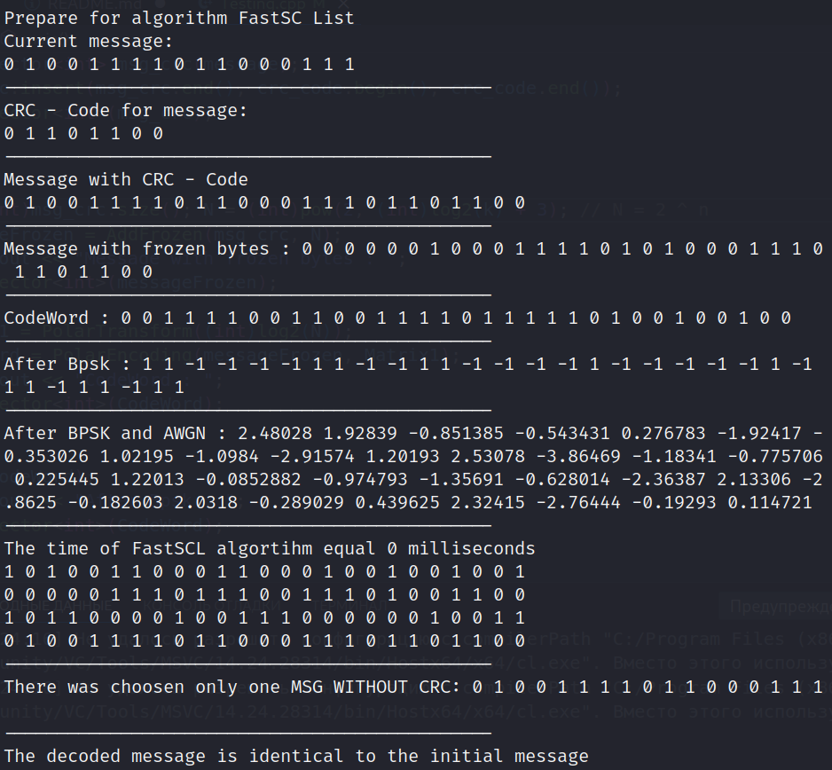

# Info
Implementation decoding algorithms of Polar Code. There are 3 type of decoders: SC, SCL, Fast SCL. 

# How to download 

Firstly, you should clone this repository 

git clone https://github.com/NickSterALPHA/PolarCode.git

Next step, in directory PolarCode, you should run requirements.sh. This bash script downloads all dependencies

./requirements.sh

# Build the project

You should create a folder to build a project

mkdir build

cd build

Also, use CMake to configure the project and make to build the project.

cmake ..

make

# Files of project

Testing -  application that helps to understand how a functions work

Graph - application  that plots the P(SNR) function, P(t) is a probability function, SNR - signal to noise 

Example of our interface:

Example of graphics

Time - application illustrating information about which algorithm is faster

# References 

In the implementation of the algorithms, we relied on scientific articles:

https://ieeexplore.ieee.org/document/8369002

